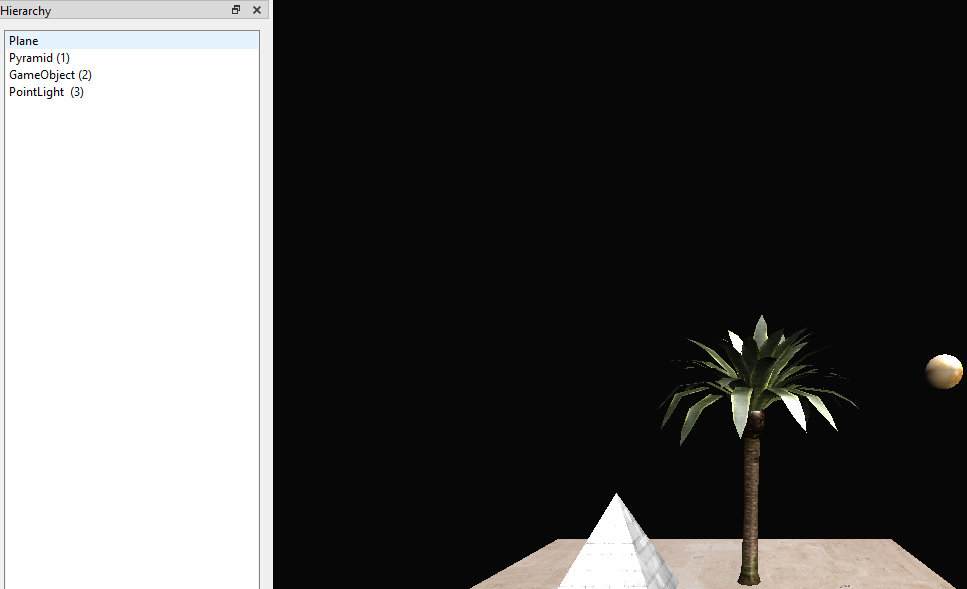
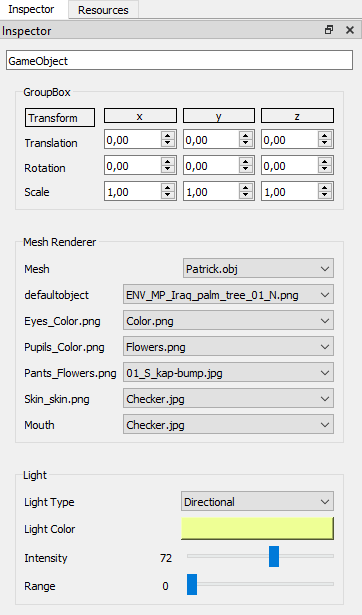
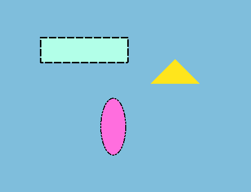

# Team Members:

- Elliot Jimenez Bosch
- Albert Llopart Navarra

# Features

### Menu

The main menu offers functionality to create a new scene, save your scene into a json file or open a previously saved scene.

### Hierarchy

The hierarchy lists every entity you have created and allows you to select either of them to edit or check their transform and rendering options.

### Inspector

The inspector provides information about the currently selected entity from the hierarchy. You can edit any parameter here.

### Renderer

The central widget is where every entity is rendered based on its own transform and rendering options.

