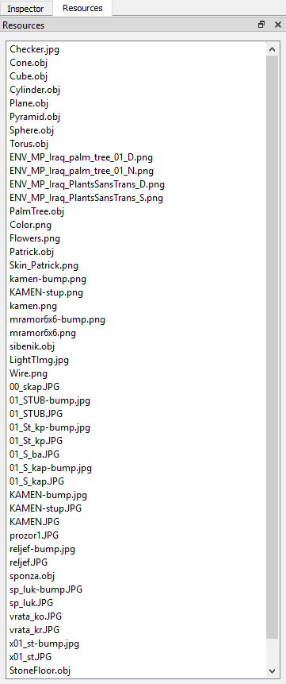
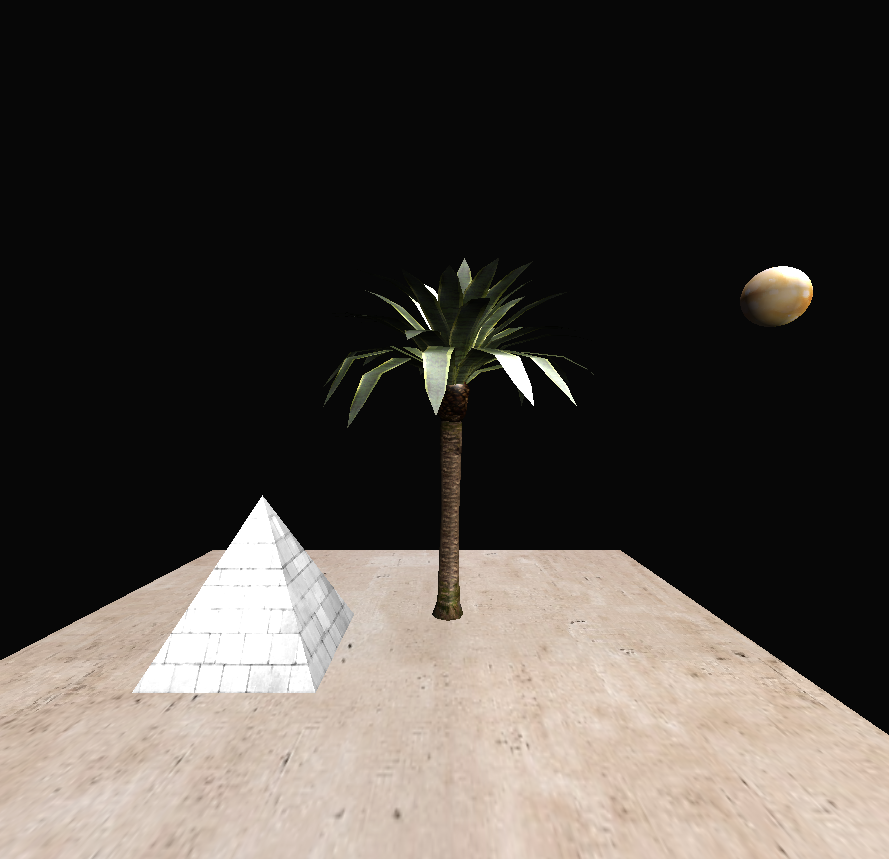
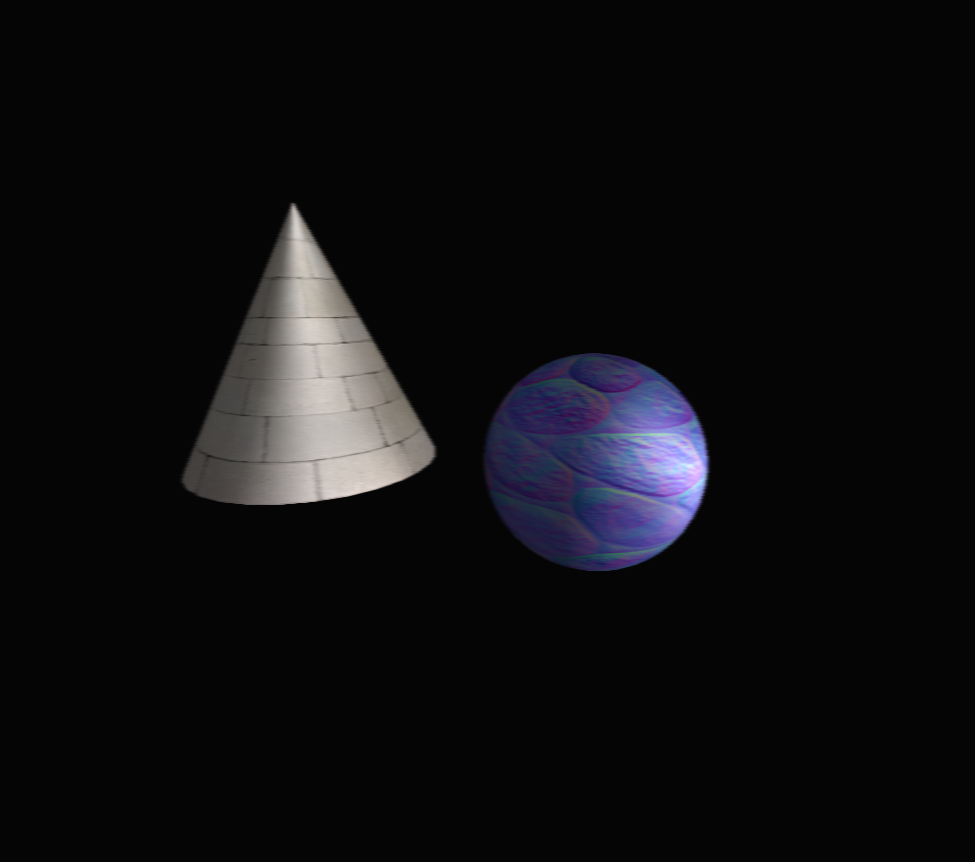
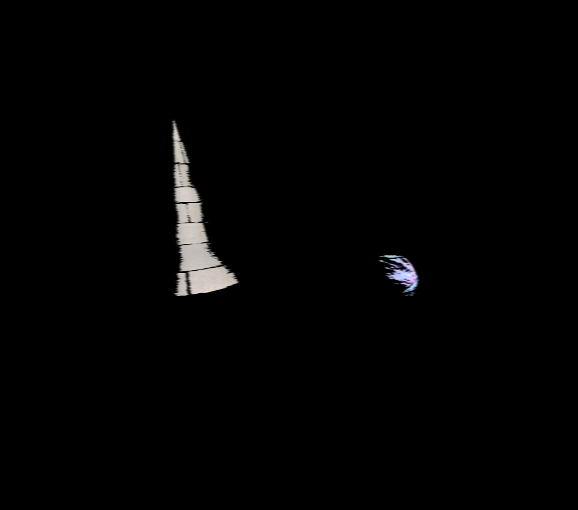

# Team Members:

- Elliot Jimenez Bosch
- Albert Llopart Navarra

# Features:

### Menu

The main menu offers functionality to create a new scene, save your scene into a json file or open a previously saved scene.

### Hierarchy

The hierarchy lists every entity you have created and allows you to select either of them to edit or check their transform and rendering options.

### Inspector

The inspector provides information about the currently selected entity from the hierarchy. You can edit any parameter here.

### Resources

Here you can check any resources that are contained in the directory, meshes and textures.

# Models and techniques

### Loading models

To load a single model simply press "Add Entity" in the hierarchy and then select that entity and press "Add mesh renderer" in the inspector. After that you just need to select whatever model that its loaded as a resource.

### Enabling/disabling techniques

To enable or disable techniques click on "Renderer" in the main menu and extend the "effects" option. Then click on whatever technique you want to activate. To disable such technique simply activate any other option from the effects.

### Camera movement

- Move around by pressing right click + WASD
- Change camera angles by pressing right click + moving the mouse
- Zoom in or out with the mouse wheel
- Drag your camera around by clicking the mouse wheel and moving your mouse

# Samples

## Default

## Blurr

## Bloom first + second step (brightness selection + gaussian blur)

