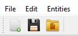
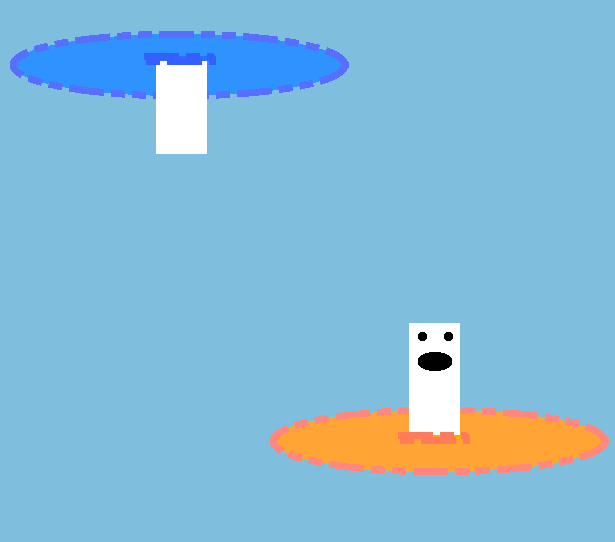

# Team Members:

- Elliot Jimenez Bosch
- Albert Llopart Navarra

# Features:

### Menu

The main menu offers functionality to create a new scene, save your scene into a json file or open a previously saved scene.

### Hierarchy

The hierarchy lists every entity you have created and allows you to select either of them to edit or check their transform and rendering options.

### Inspector

The inspector provides information about the currently selected entity from the hierarchy. You can edit any parameter here.

### Renderer

The central widget is where every entity is rendered based on its own transform and rendering options.

# Qt Features:

### Signals

Inspector:

- void MainUpdate();

Widget2DTransform:

- void InspectorUpdate();

WidgetShapeRenderer:

- void InspectorUpdate();

Qt:

- Multiple signals from QObjects in the UI

### Slots

Hierarchy:

- void AddGameObject(GameObject* gameobject);
- void RemoveGameObject();
- void GameObjectClicked(QListWidgetItem* item);
- void Update();
- void Testing();

Inspector:

- void SetName(QString);

MainWindow:

- void OpenColorDialog();
- void ColorTest();
- void updateGameObject();
- void AddGameObject();
- void RemoveGameObject();
- void SaveScene();
- void LoadScene();
- void NewScene();

Widget2DTransform:

- void UpdateTransform();
- void UpdateTransformSliderXPosition(int value);
- void UpdateTransformSliderYPosition(int value);
- void UpdateTransformSliderXScale(int value);
- void UpdateTransformSliderYScale(int value);

WidgetShapeRenderer:

- void UpdateShape();
- void UpdateSize();
- void UpdateStrokeThickness();
- void UpdateStrokeStyle();
- void UpdateFillColor();
- void UpdateStrokeColor();

### Resource Files

- Various icons for the main menu

### Actions

- New Scene
- Save Scene
- Load Scene
- Exit

### Style Sheets

- Fill color
- Stroke color

### Widget Promotion

- Central widget with QPainter

